# Sample graph — Karpathy corpus

Generated by `korely-graphrag export` on the 24 Karpathy blog posts from
[BENCHMARK.md](../BENCHMARK.md). GitHub, VSCode preview, and Obsidian all
render the Mermaid block below natively. To reproduce on your own data:

```bash
docker compose exec app korely-graphrag export -o benchmark/graph.md
```

**15 items · 14 entities · 36 edges (`--min-df 2`, default)**

Items (blue rectangles) are blog posts, entities (pink circles) are
extracted concepts/technologies/people. The `df=N` suffix on each entity
shows how many items mention it — useful for spotting hub nodes (e.g.
`Github df=4`, `Andrej Karpathy df=3`) that the IDF weighting in
[`get_related`](../src/korely_graphrag/search/graph.py) downweights.

Only entities connecting **≥ 2 items** are drawn — single-mention
entities (most of the 137 total) are omitted as visual noise. Lower
`--min-df` to see the full graph; use `--max-df` to hide hubs and reveal
the specific technical links underneath.

```mermaid
flowchart LR
  classDef item fill:#dbeafe,stroke:#1e40af,color:#000,stroke-width:1px;
  classDef entity fill:#fce7f3,stroke:#9d174d,color:#000,stroke-width:1px;

  I_92fe597960["2012-10-22-state-of-computer-vision"]:::item
  I_155d6af4d7["2013-11-23-chrome-extension-programming"]:::item
  I_f2dd451a8e["2013-11-27-quantifying-hacker-news"]:::item
  I_0fef1068a5["2014-04-26-datascience-weekly-interview"]:::item
  I_00c9105156["2014-07-01-switching-to-jekyll"]:::item
  I_70693ade8f["2014-07-02-visualizing-top-tweeps-with-t-sne-in-J…"]:::item
  I_e4aeca32c9["2014-07-03-feature-learning-escapades"]:::item
  I_04bdc8e848["2014-08-03-quantifying-productivity"]:::item
  I_3c077ed705["2014-09-02-what-i-learned-from-competing-against-…"]:::item
  I_2a40cd95c5["2015-03-30-breaking-convnets"]:::item
  I_96bb0db468["2015-05-21-rnn-effectiveness"]:::item
  I_5de4f72bef["2018-01-20-medium"]:::item
  I_c4422123b1["2019-04-25-recipe"]:::item
  I_4e31728920["2022-03-14-lecun1989"]:::item
  I_8c6654b229["2026-02-12-microgpt"]:::item
  E_a68ebc87a2(("Github<br/>df=4")):::entity
  E_f179ce0e80(("Python<br/>df=4")):::entity
  E_4daae99aff(("Andrej Karpathy<br/>df=3")):::entity
  E_60fc685ded(("Convolutional Neural Networks<br/>df=3")):::entity
  E_2922f3b38b(("Imagenet<br/>df=3")):::entity
  E_283f1c3ed5(("Javascript<br/>df=3")):::entity
  E_b053ea097d(("Adam optimizer<br/>df=2")):::entity
  E_6d9b9cb132(("AlexNet<br/>df=2")):::entity
  E_9f9f5dab0c(("CVPR 2014 Oral<br/>df=2")):::entity
  E_974c64603e(("HTML<br/>df=2")):::entity
  E_d41c7810c2(("IPython Notebook<br/>df=2")):::entity
  E_35b44931ab(("PyTorch<br/>df=2")):::entity
  E_a016e7c795(("SGD<br/>df=2")):::entity
  E_357578fe80(("Stanford<br/>df=2")):::entity

  I_04bdc8e848 --- E_283f1c3ed5
  I_4e31728920 --- E_b053ea097d
  I_4e31728920 --- E_35b44931ab
  I_92fe597960 --- E_a016e7c795
  I_5de4f72bef --- E_4daae99aff
  I_3c077ed705 --- E_6d9b9cb132
  I_0fef1068a5 --- E_4daae99aff
  I_04bdc8e848 --- E_a68ebc87a2
  I_2a40cd95c5 --- E_2922f3b38b
  I_f2dd451a8e --- E_d41c7810c2
  I_f2dd451a8e --- E_974c64603e
  I_2a40cd95c5 --- E_60fc685ded
  I_04bdc8e848 --- E_f179ce0e80
  I_3c077ed705 --- E_357578fe80
  I_f2dd451a8e --- E_f179ce0e80
  I_96bb0db468 --- E_f179ce0e80
  I_e4aeca32c9 --- E_60fc685ded
  I_92fe597960 --- E_2922f3b38b
  I_96bb0db468 --- E_a68ebc87a2
  I_e4aeca32c9 --- E_357578fe80
  I_e4aeca32c9 --- E_6d9b9cb132
  I_c4422123b1 --- E_2922f3b38b
  I_c4422123b1 --- E_4daae99aff
  I_70693ade8f --- E_283f1c3ed5
  I_155d6af4d7 --- E_283f1c3ed5
  I_3c077ed705 --- E_9f9f5dab0c
  I_155d6af4d7 --- E_974c64603e
  I_c4422123b1 --- E_35b44931ab
  I_70693ade8f --- E_a68ebc87a2
  I_00c9105156 --- E_a68ebc87a2
  I_e4aeca32c9 --- E_9f9f5dab0c
  I_8c6654b229 --- E_b053ea097d
  I_96bb0db468 --- E_60fc685ded
  I_70693ade8f --- E_d41c7810c2
  I_c4422123b1 --- E_a016e7c795
  I_8c6654b229 --- E_f179ce0e80
```



